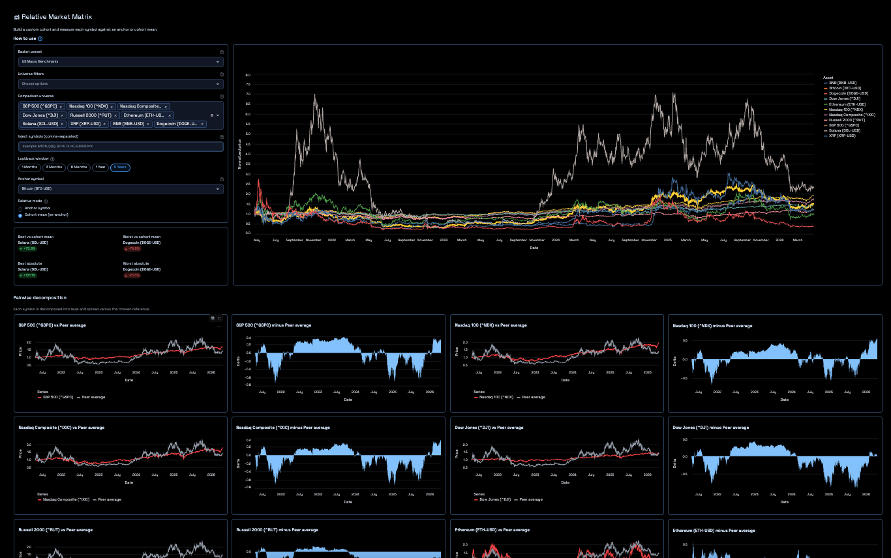
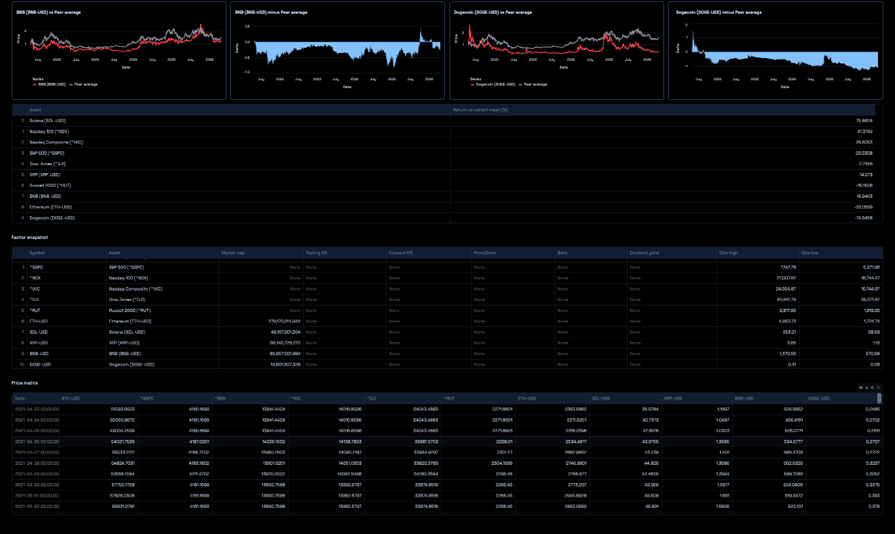

# Relative Market Matrix

Interactive Streamlit dashboard for cross-asset relative performance analysis.  
Build a custom symbol set (crypto, indices, equities, futures, FX), choose a benchmark, and compare each asset against either that benchmark or the peer-group average. This project is inspired by and credits the Streamlit stock peer analysis demo: [streamlit/demo-stockpeers](https://github.com/streamlit/demo-stockpeers)

## Deployed app on streamlit, check it out!
https://relative-market-matrix-dashboard-demo.streamlit.app/

## Preview



## Key Features

- Flexible ticker input with presets and custom symbols (`yfinance` compatible)
- Relative performance modes:
  - `Benchmark` mode (each asset vs chosen benchmark)
  - `Group average` mode (each asset vs peer average excluding itself)
- High-contrast terminal-style UI
- Main normalized trend chart with highlighted benchmark
- Per-asset pair cards:
  - asset vs reference line chart
  - spread/delta area chart
- Summary metrics:
  - best/worst vs reference
  - best/worst absolute performance
- Ratios panel with compact and extended views:
  - valuation, leverage, margins, liquidity, and cash-flow metrics

## Run Locally on any machine 

```bash
uv venv
source .venv/bin/activate
uv sync
uv run streamlit run streamlit_app.py
```

Open the local URL printed by Streamlit.

## Usage Walkthrough

Example: compare crypto + equity + index against BTC.

1. In `Assets`, select `ETH-USD`, `AAPL`, and `^GSPC`.
2. Set `Time period` to `1 Year`.
3. Set `Benchmark` to `Bitcoin (BTC-USD)`.
4. Choose `Comparison method`:
   - `Benchmark` for direct BTC-relative comparison, or
   - `Group average (excluding current asset)` for peer-relative comparison.
5. Read results in order:
   - KPI cards (`Best/Worst vs benchmark`, `Best/Worst absolute`)
   - `Trend Canvas` (normalized performance lines)
   - `Asset Detail` cards (line + spread per asset)
   - Ranking table (`Return vs ...`)
   - `Ratios` and `Price Data` tables for deeper context.

## Data Source

- Market prices and fundamentals from Yahoo Finance via `yfinance`
